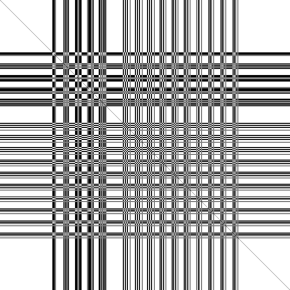
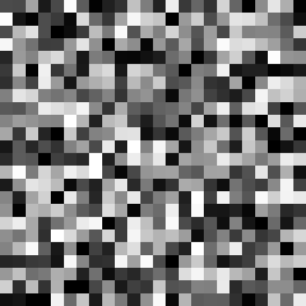
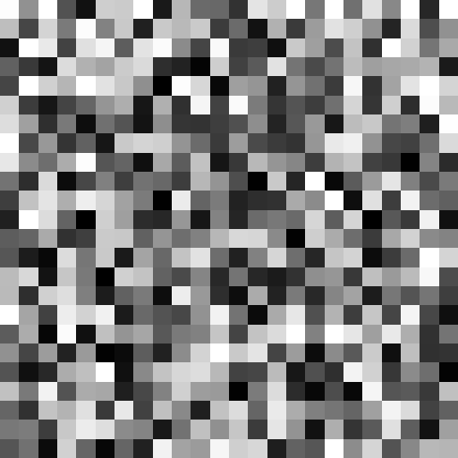

# Hopfield Networks in Rust using Chela

|  |  |  |
|----------------|------------------------|------------------------|

This is a simple Rust implementation of a Hopfield Network with Hebbian learning rules using my linear algebra and machine learning crate, [Chela](https://github.com/BhavyeMathur/chela).

## Installation & Usage

Clone this repository and run ``cargo run --release``. To create the gifs shown above (make sure you have Python installed), run

```
pip install -r requirements.txt
python output/gif_generator.py
```

This should output `model.png`, `output.png`, and `output.gif`. You can change the input image inside [src/main.rs](src/main.rs)


## Hopfield Networks

A Hopfield Network is described by a 2D matrix of weights and a 1D vector representing its current state. We can represent this in Chela as follows,

```rust
struct HopfieldNetwork<'a> {
    weights: NdArray<'a, f64>,
    state: NdArray<'a, f64>,
}
```

Suppose we have $n$ images with $p$ pixels each, where each pixel has values $\pm1$. The goal of a Hopfield network is to sample a state vector from the image distribution as closely as possible.

We can structure this data into an $n\times p$ matrix called $M$ (memory). 

```rust
memory: NdArray<f64>;

let n = memory.shape()[0] as f64;
let p = memory.shape()[1];
```

According to the Hebbian learning rule, we set the weights to

$$\text{weights} = \frac{1}{n}M^\top M$$

and set the weights along the diagonal to 0.

```rust
let mut weights = (&memory).T().matmul(&memory);
weights *= 1.0 / n;
weights.diagonal().zero();
```

To generate new images from the Hopfield Network, we initialize a state vector with $p$ random entries, called *neurons*.

```rust
let state = NdArray::uniform([p], -1.0, 1.0);
```

and iteratively update random entries according to the following rule,

$$\text{state}_i= \begin{cases}
1, &          \text{state} \cdot \text{weights}_i \ge0,\\
-1, &         \text{otherwise}
\end{cases}$$

where $\text{weights}_i$ refers to column $i$ of the weight matrix.

```rust
// random number generator to pick the neuron to update
let mut rng = rand::rng();
let uniform = Uniform::try_from(0..p).unwrap();

for _ in 0..steps {
    // randomly select a neuron
    let neuron = uniform.sample(&mut rng);
    
    let weight_col = weights.slice([neuron])
    let activation = weight_col.dot(state);
    
    // update the neuron
    self.state[neuron] =
        if activation.value() >= 0.0 {
            1.0;
        } else {
            0.0;
        }
}
```
